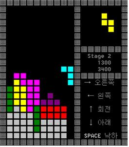

C++을 이용한 테트리스 게임만들기
============
>학과 수업인 객체지향프로그램의 최종과제로 테트리스 게임을 C++로 구현하여 콘솔창에서 수행가능 하도록 개발하였다.

개발 기간 및 환경
-------------
* 기간 : 2015.05 ~ 2015.06
* OS : window 8.1
* Language : C++
* Tools : Visual Studio 2013

개발 내용
-------------
* 모양별로 다른 색의 테트로미노가 등장한다.
* 초반엔 그림자가 테트로미노가 떨어질 위치를 가르쳐준다.
* 라인이 삭제 될 경우 남은 테트로미노는 회색으로 변한다.
* 1줄 삭제 시 100점, 2줄 삭제 시 300점, 3줄 삭제시 500점, 4줄 삭제 시 1000점 부여.
* 점수판은 각각 현재스테이지/현재점수/총점수를 나타낸다.
* 현재점수 2000점 도달 시 스테이지가 올라가고 테트로미노가 떨어지는 속도가 빨라진다.

실행 화면
-------------
